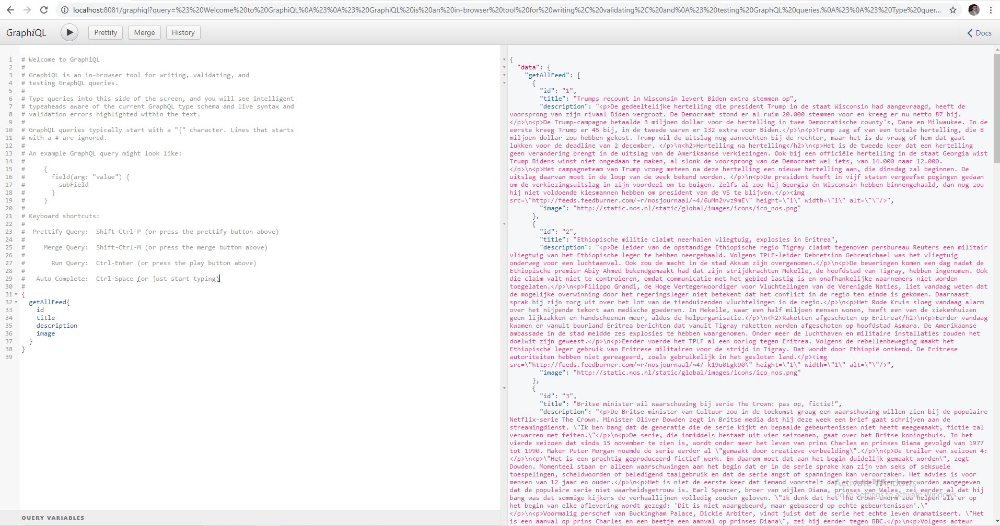

## To run the application:

1. Run **mvn clean install** in terminal

2. Run spring boot application (TaskApplication.class)

3. go to http://localhost:8081/graphiql and put following search query:

```
{
  getAllFeed{
    id
    title
    description
    image
  }
}
```

run query and you should get results from the feed like example below:


